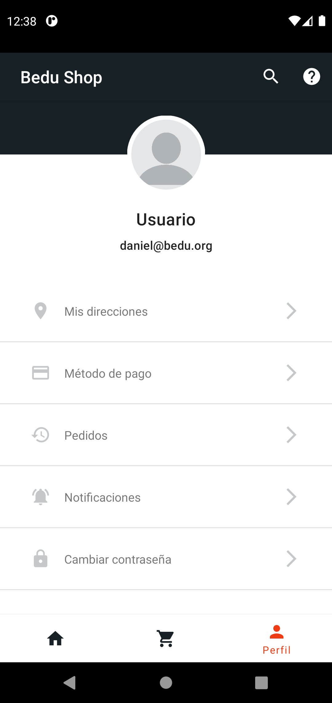
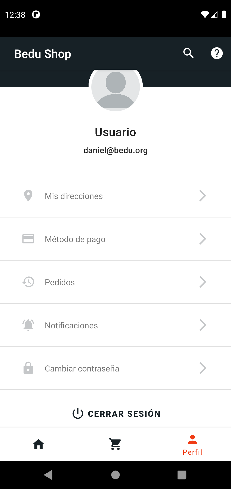
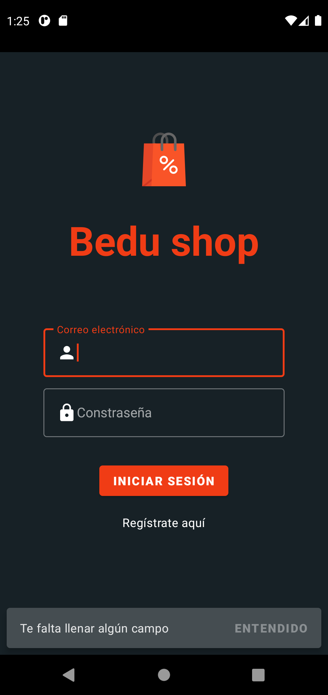
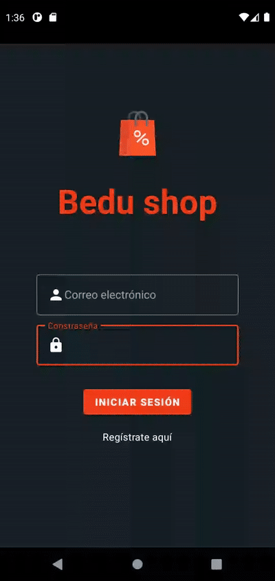
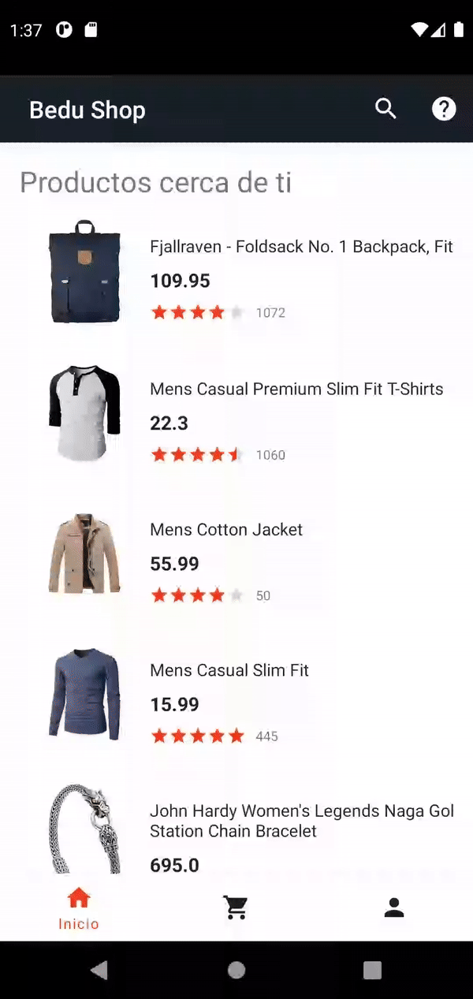
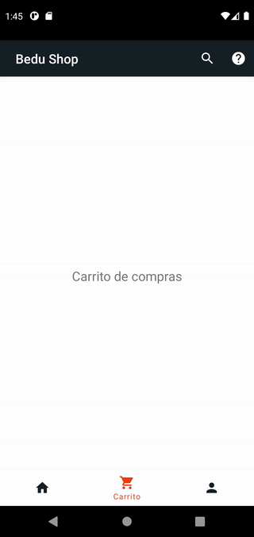

[`Kotlin Avanzado`](../../Readme.md) > [`Sesión 02`](../Readme.md) > `Proyecto`

## Proyecto

<div style="text-align: justify;">

### 1. Objetivos :dart:

- Hacer llamadas a servicios remotos mediante el consumo de una API
- Utilizar el cliente Retrofit

### 2. Requisitos :clipboard:

1. Android Studio Instalado en nuestra computadora.


### 3. Desarrollo :computer:

En esta sesión hicimos peticiones a servidores remotos utilizando clientes Http, mediante una API Rest. A continuación implementaremos algunos servicios públicos en nuestra aplicación.


### Pantalla de perfil

Para comenzar, requerimos crear la siguiente pantalla de perfil:


 

* La lista de elementos es un simple RecyclerView con una lista de datos predefinida.

* La imagen redondeada puede ser un ShapeableImageView, con las esquinas redondeadas al 50%: 

   Este puede ser el estilo de la forma

  ```xml
  <style name="ShapeAppearanceOverlay.BeduCompras.CornerSize50Percent" parent="">
      <item name="cornerSize">50%</item>
  </style>
  ```

Y este el elemento

```xml
<com.google.android.material.imageview.ShapeableImageView                                                       		app:shapeAppearanceOverlay="@style/ShapeAppearanceOverlay.BeduCompras.CornerSize50Percent"
		app:strokeColor="?attr/elegirColor"
		app:strokeWidth="tamañoDelContorno"
		...
/>
```


### Servicio de login

Para iniciar sesión y recuperar datos de usuario, verificaremos que el usuario haya ingresado tanto un usuario como una contraseña, de no ser así, debemos mostrar el siguiente mensaje al intentar iniciar sesión:




Para autenticarnos, utilizaremos la API que nos proporciona https://reqres.in. El primer servicio que ocuparemos de esta interfaz será la de inicio de sesión, cuyos datos son los siguientes:

- **url: ** *https://reqres.in/api/login*
- **Http Method**: POST
- **Fields:** email (String), password (String)
- **Forma de envío de parámetros:** Form url encoded.

La respuesta exitosa tiene la siguiente forma:

```json
{
    "token": "QpwL5tke4Pnpja7X4"
}
```


Por limitaciones de la API pública, los correos registrados se reducen a la siguiente lista:

> george.bluth@reqres.in
>
> janet.weaver@reqres.in
>
> emma.wong@reqres.in
>
> eve.holt@reqres.in
>
> charles.morris@reqres.in
>
> tracey.ramos@reqres.in
>
> michael.lawson@reqres.in
>
> lindsay.ferguson@reqres.in
>
> tobias.funke@reqres.in
>
> byron.fields@reqres.in
>
> george.edwards@reqres.in
>
> rachel.howell@reqres.in

Mientras que la contraseña puede ser cualquiera que tenga al menos un caracter.

Al tener una respuesta no exitosa, debemos mostrar un Snackbar indicando nuestro error. 

A continuación se visualiza el resultado final de esta tarea:




### Información de perfil

Con el layout previamente creado, cargaremos la información obtenida de nuestra API pública en nuestros views de imagen, nombre y correo electrónico al ingresar a dicho fragment.

la información de la petición es la siguiente:

- **url: ** *https://reqres.in/api/users/{número-del-1-al-12}
- **Http Method**: GET

La respuesta tiene la siguiente forma:

```json
{
    "data": {
        "id": 2,
        "email": "janet.weaver@reqres.in",
        "first_name": "Janet",
        "last_name": "Weaver",
        "avatar": "https://reqres.in/img/faces/2-image.jpg"
    },
    "support": {
        "url": "https://reqres.in/#support-heading",
        "text": "To keep ReqRes free, contributions towards server costs are appreciated!"
    }
}
```


Para obtener el id de usuario, simplemente generaremos un número aleatorio entre el 1 y el 12, sin importar si el perfil cambie.

La implementación se vería así:



### Recuperación de lista de productos

Para esta tarea, tenemos una cierta ventaja: el json guardado de forma local en nuestro proyecto es la respuesta que arrojará el servicio con el que nos comunicaremos, por lo cual no requerimos de crear un nuevo data model para la respuesta de este.

Modificaremos el layout para poder incorporar una barra de progreso horizontal pegado en la parte superior de nuestro _fragment_ que estará visible hasta que la información cargue, en ese momento se volverá invisible y se visualizará tanto el recycler View como el título de productos (invisibles anteriormente).

- **url: ** *https://fakestoreapi.com/products*
- **Http Method**: GET


El resultado sería el siguiente:




### Recursos

* [Documentación](https://fakestoreapi.com/) de la API de la tienda.
* [Documentación](https://reqres.in/) de la API de login y de los datos de usuario.


[`Anterior`](../Reto-03) | [`Siguiente`](../Readme.md)

</div>

