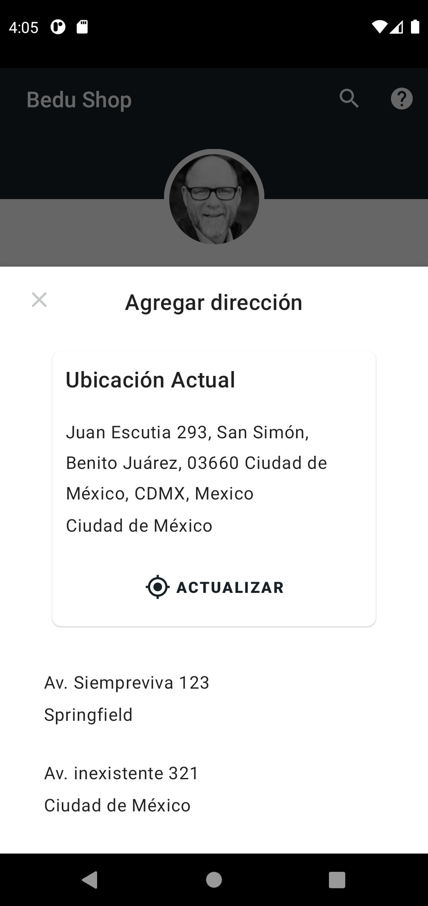

[`Kotlin Avanzado`](../../Readme.md) > [`Sesión 03`](../Readme.md) > `Proyecto`

## Proyecto

<div style="text-align: justify;">


### 1. Objetivos :dart:

- Utilizar el GPS para obtener las coordenadas de localización
- Recuperar una dirección para desplegar

### 2. Requisitos :clipboard:

1. Android Studio Instalado en nuestra computadora.


### 3. Desarrollo :computer:

En el anterior reto, creamos la pantalla de perfil, donde tenemos varias opciones de configuración para nuestra cuenta. Una de ellas era la selección de dirección, que no tenía ninguna funcionalidad. En esta sección del proyecto, simularemos la obtención de nuestra localización para obtener la dirección en donde se encuentra el dispositivo.


### Diálogo emergente

Al pulsar sobre la opción de dirección, debe emerger desde la parte de abajo un panel a manera de diálogo que contenga una sección donde se permita obtener y actualizar nuestra actual dirección, así como una lista de direcciones "preregistradas".

Para esto, crearemos un nuevo _fragment_ que derive de la clase ___BottomSheetDialogFragment___, que para fines prácticos, es casi idéntico a un fragment normal. Para crear y lanzar nuestro _diálogo_, debemos instanciar en una variable en nuestro perfil.

```kotlin
private val addressFragment = AddressFragment()
```

Al desplegarlo, debemos llamar al método ___show()___.

```kotlin
addressFragment.show(parentFragmentManager,"fragment")
```

 

El layout contará con un botón de cerrar, debe esconder nuestro panel, esto mediante el método:

```kot
dismiss()
```


El layout debe quedar de la siguiente forma: 




### Servicio de localización y Geocoder

Utilizaremos un ___FusedLocationProviderClient___ para obtener la última localización conocida para obtener nuestras coordenadas. Estas coordenadas pasarán por un proceso de ___Geocoder___ invertido, que transformará nuestra latitud y longitud en una dirección. El Geocoder se obtiene de la siguiente forma:

```kotlin
val geocoder = Geocoder(requireContext(), Locale.getDefault())
```

Mediante el siguiente método, podemos obtener una lista de posibles direcciones. Por motivos prácticos, utilizaremos un sólo resultado:

```kotlin
val addresses = geocoder.getFromLocation(latitude, longitude, 1)
```

de aquí extraeremos el ___addressLine___ (dirección) y la ___locality___ (ciudad), para desplegarlo en nuestros textos.


El resultado final debe verse de la siguiente forma:


### Recursos

1. [Documentación](https://developer.android.com/reference/android/location/Geocoder) de la clase ***Geocoder***.
2. Los íconos nuevamente los obtuve mediante Vector Asset.

[`Anterior`](../Reto-03) | [`Siguiente`](../Readme.md)

</div>

