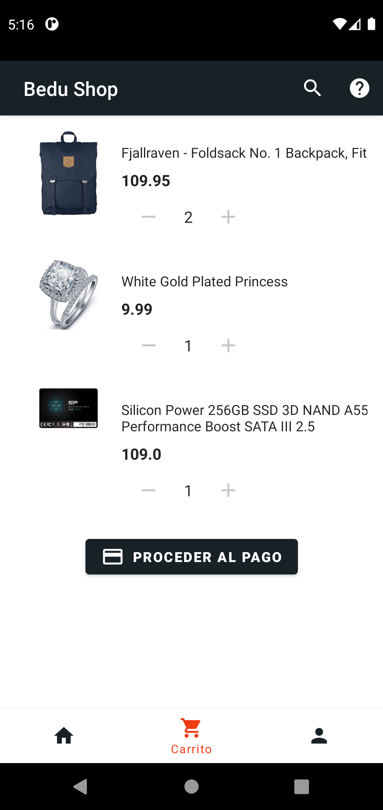
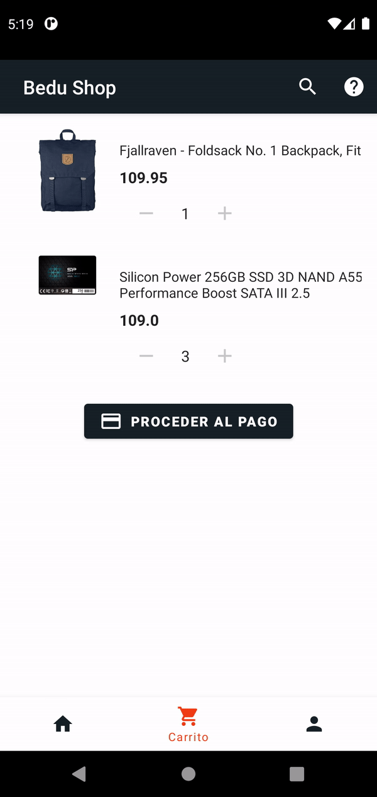
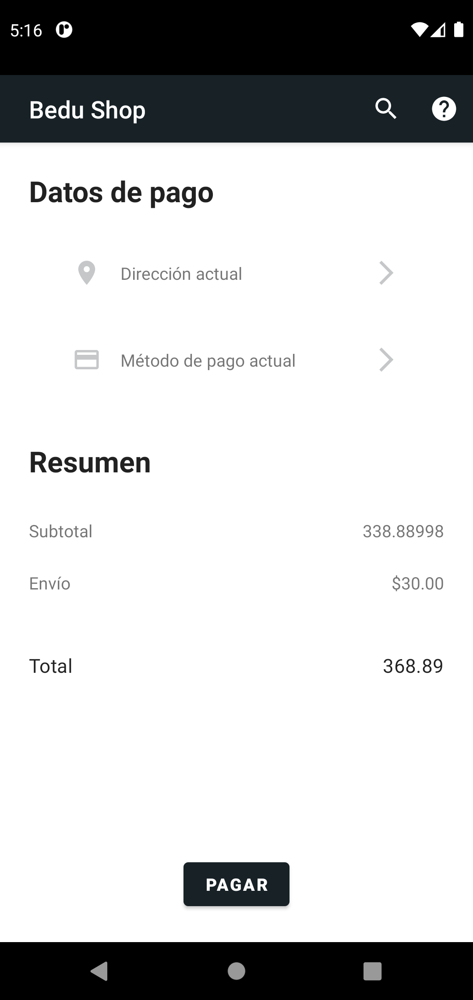
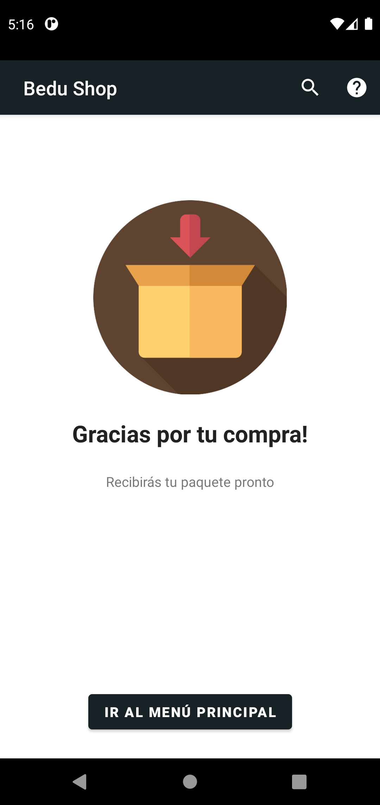

[`Kotlin Avanzado`](../../Readme.md) > [`Sesión 04`](../Readme.md) > `Proyecto`

## Proyecto

### 1. Objetivos :dart:

* Utilizar Realm para almacenar un set de datos locales
*  Manipular la información guardada para su uso en la app.

### 2. Requisitos :clipboard:

* Librería Realm

### 3. Desarrollo :computer:

En esta parte del proyecto, haremos uso de la librería Realm, que nos va a servir para guardar una representación de algún set de elementos que tengan una importancia protagónica en nuestra app, que en este caso, será la lista productos.

#### Carrito de compras

La implementación del carrito de compras consta de una lista de elementos en nuestro carrito, y un botón que nos lleve a proceder con el pago de nuestra lista.

La lista de productos en el carrito desplegará únicamente la imagen de nuestro producto, así como el título de este, su precio, un indicador numérico de la cantidad de productos a adquirir y dos botones para aumentar y disminuir la cantidad de productos de ese tipo. El layout a diseñar tendrá la siguiente configuración:

El comportamiento de la pantalla es el sigiuiente:

* Cada vez que agreguemos un producto desde el detalle de un producto, este se debe de agregar a la pantalla, donde almacenaremos los productos totales. Este proceso se puede repetir para un mismo producto. 

* Si agregamos dos veces un elemento desde la pantalla de detalles de producto, en vez de duplicarse el producto en la lista del carrito, se debe mostrar un solo item con el indicador de cantidad en 2.

* Tendremos la opción de aumentar y disminuir la cantidad de elementos en nuestro carrito. Cada vez que pulsemos agregar un elemento, se debe guardar un nuevo elemento de ese producto en  nuestro carrito, por lo tanto el indicador numérico debe aumentar una unidad.

* Al disminuir nuestra cantidad de productos, se quitará un elemento de ese producto en nuestro carrito y el indicador numérico deberá disminuir una unidad. En caso de que tengamos un solo producto y disminuyamos a cero, debemos eliminar el item de nuestra lista.
* Al pulsar el botón de pagar elementos, navegaremos a la pantalla de resúmen de la compra.

El resultado final es el siguiente:

#### Resumen del pago

En esta pantalla, Mostraremos los detalles del pago que son la dirección de envío y el método de pago. Tranquilo! los datos que van ahí son datos dummy, así que escribe los textos que aparecen en la visualización de la pantalla :smile:.

En la sección de Resumen de la pantalla, mostraremos el subtotal, que es la sumatoria de los precios de todos los productos en el carrito. 

El costo de envío será de $30.00 fijos y se sumará con el subtotal para obtener el precio total, que se muestra también en pantalla.

 Finalmente, al pulsar sobre el botón *pagar*, todos los elementos de nuestro carrito de compras serán eliminados y navegaremos a la pantalla de pago exitoso.

El resultado final es el siguiente:

#### Pago exitoso

Al realizar el pago, navegaremos a una nueva pantalla. Este Fragment no tendrá otra funcionalidad que desplegar un mensaje de transacción exitosa, y tendrá un botón que nos redirigirá a la lista de productos.

#### Implementación de la DB 

Se debe utilizar Realm para modelar la base de datos de los productos en nuestra lista, de esta forma en la pantalla de productos como en la del carrito la información se obtiene a partir de esta base. 

#### Resultado final

Como resultado de la unión de la descripción anterior, tenemos el siguiente flujo:

#### Recursos

* [Imagen](resources/img_package.png) de paquete para la pantalla de pago exitoso.

[`Anterior`](../Reto-02) | [`Siguiente`](../Readme.md)      

