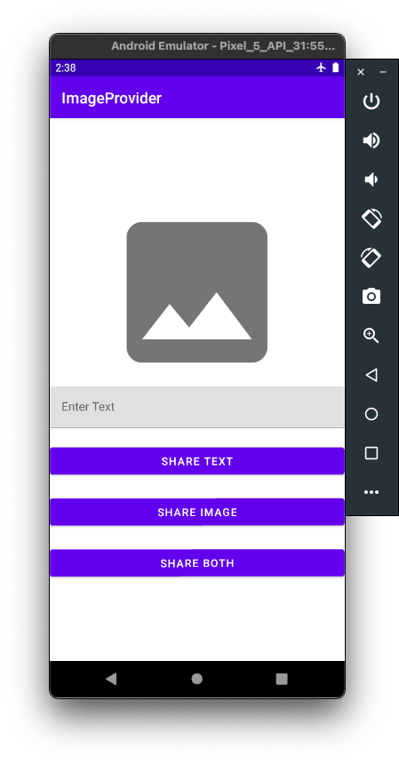
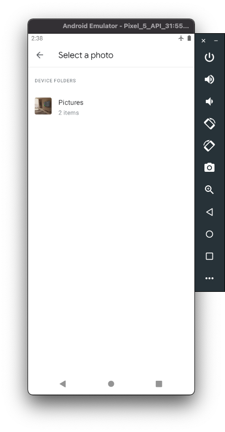

[`Kotlin Avanzado`](../../Readme.md) > [`Sesión 04`](../Readme.md) > `Ejemplo 2 `

## Ejemplo 2: File Providers

<div style="text-align: justify;">


### 1. Objetivos :dart:

* Enviar información de la app a aplicaciones externas

### 2. Requisitos :clipboard:

- Android Studio


### 3. Desarrollo :computer:

`FileProvider` es una subclase especial de `ContentProvider` que facilita el intercambio seguro de archivos asociados con una aplicación mediante la creación de un contenido: `Uri` para un archivo en lugar de un archivo.

Un identificador de recursos uniforme o URI —del inglés uniform resource identifier— es una cadena de caracteres que identifica los recursos de una red de forma unívoca.

Un URI de contenido le permite otorgar acceso de lectura y escritura mediante permisos de acceso temporales. Cuando crea un Intent que contiene un URI de contenido. Estos permisos están disponibles para la aplicación cliente mientras la pila de una android.app.Activity receptora esté activa. Para un Intent que va a un android.app.Service, los permisos están disponibles siempre que se esté ejecutando android.app.Service.

En comparación, para controlar el acceso a un archivo: `Uri`, debe modificar los permisos del sistema de archivos del archivo subyacente. Los permisos que proporcione estarán disponibles para cualquier aplicación y permanecerán vigentes hasta que los cambie. Este nivel de acceso es fundamentalmente inseguro.

1. Primero observemos que las dependencias del archivo `app/build.gradle` se vean de esta forma.

```kotlin
dependencies {

    implementation 'androidx.core:core-ktx:1.6.0'
    implementation 'androidx.appcompat:appcompat:1.3.1'
    implementation 'com.google.android.material:material:1.4.0'
    implementation 'androidx.constraintlayout:constraintlayout:2.1.1'
    testImplementation 'junit:junit:4.13.2'
    androidTestImplementation 'androidx.test.ext:junit:1.1.3'
    androidTestImplementation 'androidx.test.espresso:espresso-core:3.4.0'
}
```
2. Es necesario definir permisos de manejo de memoria para poder consultar los archivos del dispositivo, esto en el `AndroidManifest`

```xml
<uses-permission android:name="android.permission.READ_EXTERNAL_STORAGE"/>

```

3. También se define un provider que será el encargado de traer las imágenes para la carga en la aplicación, con el siguiente código:

```xml
        <provider
            android:authorities="org.bedu.imageprovider.fileprovider"
            android:name="androidx.core.content.FileProvider"
            android:exported="false"
            android:grantUriPermissions="true">
            <meta-data
                android:name="android.support.FILE_PROVIDER_PATHS"
                android:resource="@xml/files_paths" />

        </provider>
```

Es importante notar que se le están proporcionando permisos de URI para la creación de éstas.

4. Creamos un archivo de recursos para definir las rutas que tendrán las imágenes de carga en nuestra aplicación. Para esto sobre res **New > Android Resource Directory** y elegimos la opción xml, una vez creado el directorio agregamos un archivo y definimos las rutas como sigue:

```xml
<?xml version="1.0" encoding="utf-8"?>
<paths xmlns:android="http://schemas.android.com/apk/res/android">

    <cache-path
        name="shared_images"
        path="images/"/>
    <external-path
        name="saved_images"
        path="MyImagesToShare"/>

</paths>
```

5. Creamos un Vector con el icono de una imagen dentro de **drawable**

6. En el layout de la Main Activity agregamos la siguiente definición

```xml
<?xml version="1.0" encoding="utf-8"?>
<LinearLayout xmlns:android="http://schemas.android.com/apk/res/android"
    xmlns:app="http://schemas.android.com/apk/res-auto"
    xmlns:tools="http://schemas.android.com/tools"
    android:layout_width="match_parent"
    android:gravity="center"
    android:layout_height="match_parent"
    android:orientation="vertical"
    tools:context=".MainActivity">

    <ImageView
        android:layout_width="250dp"
        android:layout_height="250dp"
        android:id="@+id/imageIv"
        android:src="@drawable/ic_baseline_image_24"
        android:scaleType="centerCrop"
        android:adjustViewBounds="true"/>

    <com.google.android.material.textfield.TextInputLayout
        android:layout_width="match_parent"
        android:layout_height="wrap_content"
        android:hint="Enter Text">

        <EditText
            android:layout_width="match_parent"
            android:layout_height="wrap_content"
            android:id="@+id/textEt"
            android:inputType="textCapSentences|textMultiLine"/>
    </com.google.android.material.textfield.TextInputLayout>

    <com.google.android.material.button.MaterialButton
        android:layout_width="match_parent"
        android:layout_height="wrap_content"
        android:id="@+id/shareTextBtn"
        android:text="Share Text"
        android:layout_marginTop="20dp"/>

    <com.google.android.material.button.MaterialButton
        android:layout_width="match_parent"
        android:layout_height="wrap_content"
        android:id="@+id/shareImageBtn"
        android:text="Share Image"
        android:layout_marginTop="20dp"/>

    <com.google.android.material.button.MaterialButton
        android:layout_width="match_parent"
        android:layout_height="wrap_content"
        android:id="@+id/shareBothBtn"
        android:text="Share Both"
        android:layout_marginTop="20dp"/>

</LinearLayout>
```

7. Ahora definiremos la funcionalidad desde el archivo `MainActivity.kt`, primero declaramos los componentes del layout

```kotlin
    private lateinit var shareTextBtn : MaterialButton
    private lateinit var shareImageBtn : MaterialButton
    private lateinit var shareBothBtn : MaterialButton
    private lateinit var imageIv : ImageView
    private lateinit var textEt : EditText
```

y también declaramos la URI a general inicial izada en `null` y el texto que compartirá nuestra aplicación.

```kotlin
    private var imageUri : Uri? = null
    private var textToShare = ""
```

8. Inicializamos en el método `onCreate()` los componentes del layout.

```kotlin
        shareBothBtn = findViewById(R.id.shareBothBtn)
        shareImageBtn = findViewById(R.id.shareImageBtn)
        shareTextBtn = findViewById(R.id.shareTextBtn)
        imageIv = findViewById(R.id.imageIv)
        textEt = findViewById(R.id.textEt)
```

9. Primero definimos una función encargada de subir una imagen a la aplicación

```kotlin
    private fun pickImage(){
        val intent = Intent(Intent.ACTION_PICK)
        intent.type = "image/*"
        galleryActivityResourceLauncher.launch(intent)
    }
```

Esta función requiere un `galleryActivityResourceLauncher` que definimos como sigue para que use la URI definida en lugar del archivo completo

```kotlin
    private var galleryActivityResourceLauncher = registerForActivityResult(
        ActivityResultContracts.StartActivityForResult(),
        ActivityResultCallback<ActivityResult> { result ->
            if (result.resultCode == Activity.RESULT_OK){
                showToast("Se eligio la imagen")
                val intent = result.data
                imageUri = intent!!.data
                imageIv.setImageURI(imageUri)
            }
            else{
                showToast("Cancelado")
            }
        }
    )
```

el `galleryActivityResourceLauncher` se encarga de lanzar el selector de archivos del sistema operativo para que se elija la imagen a cargar, posteriormente verifica el resultado de la carga y en el caso de que se haya cargado una imagen genera su URI y la pinta en la pantalla.

9. Se define una función encargada de lanzar `Toast`

```kotlin
    private fun showToast(message:String){
        Toast.makeText(this,message,Toast.LENGTH_LONG).show()
    }
```

10. Se define una función encargada de obtener el URI del contenido a compartir, para poder usarlo fuera de la aplicación que estamos definiendo. El URI se define a partir de un Bitmap, que es una matriz de bits que representa el contenido que vamos a compartir en este caso un archivo de imagen.

```language
    private fun getContentUri():Uri?{
        val bitmap : Bitmap

        if (Build.VERSION.SDK_INT >= Build.VERSION_CODES.P){
            val source = ImageDecoder.createSource(contentResolver, imageUri!!)
            bitmap = ImageDecoder.decodeBitmap(source)
        }
        else{
            bitmap = MediaStore.Images.Media.getBitmap(contentResolver,imageUri)
        }

        val imagesFolder = File(cacheDir,"images")
        var contentUri : Uri? = null

        try {
            imagesFolder.mkdir()
            var file = File(imagesFolder,"shared_image.png")
            val stream = FileOutputStream(file)
            bitmap.compress(Bitmap.CompressFormat.PNG,50,stream)
            stream.flush()
            stream.close()
            contentUri = FileProvider.getUriForFile(this,"org.bedu.imageprovider.fileprovider",file)
        }
        catch (e:Exception){
            showToast("Oh no ... ${e.message}")
        }
        return contentUri
    }
```

- Primero tenemos que considerar que el proceso de creación va a cambiar un poco dependiendo del SDK utilizado pues de versiones menores a 29 se tiene que usar otra biblioteca para codificar la imagen como un Bitmap.
- Definimos un directorio en cache para almacenar el archivo de imagen y dentro de este creamos un archivo de imagen.
- Usamos el bitmap de la imagen para generarla dentro del nuevo archivo, esto se hace en un `Stream` que es una sucesión de instrucciones anidadad que van generando un objeto.
- Por último recuperamos la URI del archivo que acabamos de crear.

11. Ahora definimos las funciones que se encargan de compartir los objetos de nuestra aplicación, en este caso vamos a compartir dos tipos de elementos, texto e imágenes. Creamos una función para cada uno y una que se encarga de compartir ambos. La información se comparte mediante un Intent.

- `shareText()`

```kotlin
    private fun shareText(){
        var intent = Intent(Intent.ACTION_SEND)
        intent.type = "text/plain"
        intent.putExtra(Intent.EXTRA_SUBJECT, "Subject Here")
        intent.putExtra(Intent.EXTRA_TEXT, textToShare)
        startActivity(Intent.createChooser(intent,"share via"))
    }
```
- `shareImage()`

```kotlin
    private fun shareImage(){
        val contentUri = getContentUri()
        var intent = Intent(Intent.ACTION_SEND)
        intent.type = "image/png"
        intent.putExtra(Intent.EXTRA_SUBJECT, "Subject Here")
        intent.putExtra(Intent.EXTRA_STREAM, contentUri)
        intent.addFlags(Intent.FLAG_GRANT_READ_URI_PERMISSION)
        startActivity(Intent.createChooser(intent,"share via"))

    }
```
- `shareImageText()`

```kotlin
    private fun shareImageText(){
        val contentUri = getContentUri()
        var intent = Intent(Intent.ACTION_SEND)
        intent.type = "image/png"
        intent.putExtra(Intent.EXTRA_SUBJECT, "Subject Here")
        intent.putExtra(Intent.EXTRA_TEXT, textToShare)
        intent.putExtra(Intent.EXTRA_STREAM, contentUri)
        intent.addFlags(Intent.FLAG_GRANT_READ_URI_PERMISSION)
        startActivity(Intent.createChooser(intent,"share via"))

    }
```

12. Por último asignamos los listeners, a los elementos de la interfaz para que hagan su trabajo. Esto dentro del `onCreate()` y con las respectivas validaciones de existencia.

```kotlin
        imageIv.setOnClickListener {
            pickImage()
        }

        shareTextBtn.setOnClickListener{
            textToShare = textEt.text.toString().trim()
            if (textToShare.isEmpty()){
                showToast("No hay texto ...")
            }
            else{
                shareText()
            }

        }

        shareImageBtn.setOnClickListener {
            if(imageUri == null){
                showToast("Falta la imagen ...")
            }
            else {
                shareImage()
            }
        }

        shareBothBtn.setOnClickListener {
            textToShare = textEt.text.toString().trim()
            if (textToShare.isEmpty()){
                showToast("No hay texto ...")
            }
            else if(imageUri == null){
                showToast("Falta la imagen ...")
            }
            else{
                shareImageText()
            }
        }

```

13. Lo probamos y el resultado debe de ser el siguiente: 






[`Anterior`](../Reto-01) | [`Siguiente`](../Readme.md)      

</div>

