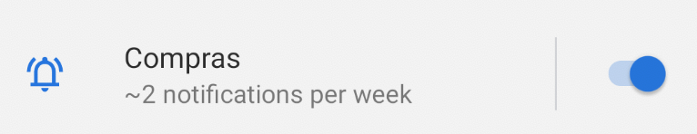

[`Kotlin Avanzado`](../../Readme.md) > [`Sesión 06`](../Readme.md) > `Proyecto`

## Proyecto

<div style="text-align: justify;">
### 1. Objetivos :dart:

* Implementar notificaciones locales

### 2. Requisitos :clipboard:

* Android Studio

### 3. Desarrollo :computer:

Las notificaciones son un medio muy importante para la comunicación entre el usuario y la aplicación, pues este alerta al usuario de distintas novedades y mantiene el flujo de uso.

Vamos a implementar un canal único a nuestra aplicación para lanzar una notificación. 

#### Creación de canal

Nuestro canal se creará en la raíz del proyecto, puede ser dentro de un Activity o Fragment maestro, o incluso en un Application. Afortunadamente, el método ___setNotificationChannel___ es seguro, ya que si el canal ya existe, el método no se reproduce.

En la configuración de la aplicación, el canal se ve de la siguiente manera:




### Envío de la notificación

La notificación se debe reproducir cada vez que se efectúe una compra. Al dar click sobre la notificación, esta debe llevarnos a la pantalla de compra realizada.

 Esta se debe ver de la siguiente forma:


Para navegar a un Fragment en vez de a un activity por medio de una notificación, podemos utilizar un ***Deep Link*** a través de nuestro navigation component y lanzarlo por medio de un ___pending intent___.

```kotlin
val pendingIntent = NavDeepLinkBuilder(requireContext())
    .setComponentName(<ActivityContenedora>::class.java)
    .setGraph(<id_del_nav_graph>)
    .setDestination(<id_del_destino>)
    .createPendingIntent()
```


El resultado final deberá ser el siguiente:


[`Anterior`](../Reto-02) | [`Siguiente`](../Readme.md)      

</div>

